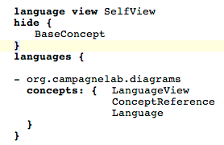

## UML_Diagrams

This language makes it possible to generate a UML class diagram in the Plant UML text format using information from concepts of one or more MPS languages.

## Example 

Import the language in a sandbox model under Used Languages and create a Language View AST root node. You can add languages to this view and reference concept inside each language. Ffor instance, here's a languge view where the concepts of the org.campagnelab.diagrams language have been referenced (self-view).

If you generate or preview generation, you will create this file:

@startuml

package org.campagnelab.diagrams {

class LanguageView {
}
BaseConcept <|-- LanguageView 
LanguageView o-- Language

class ConceptReference {
}
BaseConcept <|-- ConceptReference 

class Language {
}
BaseConcept <|-- Language 
Language o-- ConceptReference

}
@enduml

Viewed with the PlantUML chrome extension, you will see this diagram:

